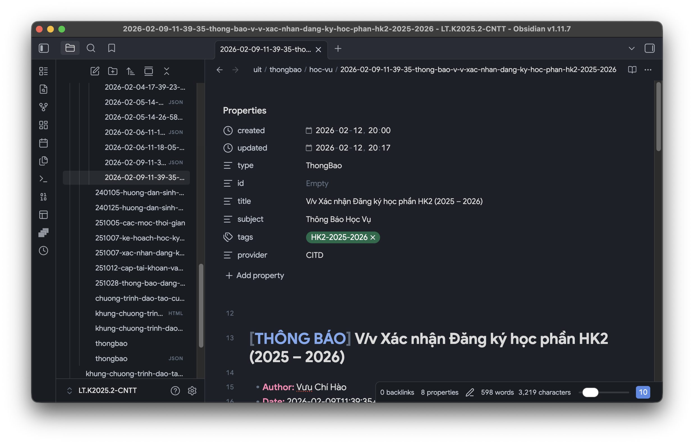
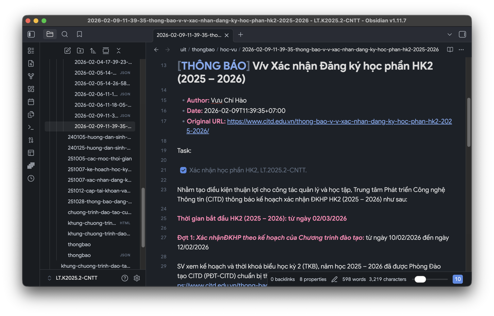
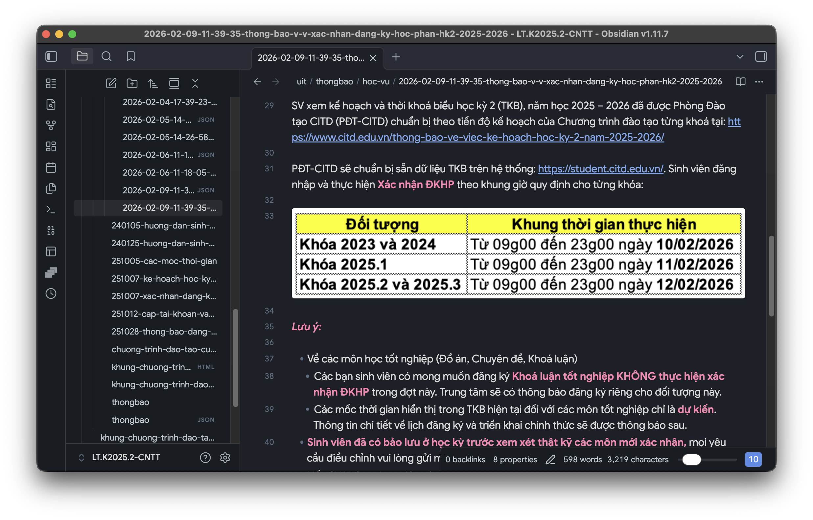

# Ứng dụng Quét & Xem Thông báo CITD

Dự án này cung cấp một công cụ cào dữ liệu (scraper) cho các thông báo của CITD và một ứng dụng Streamlit để xem và gắn thẻ cục bộ phục vụ cho cách quản lý của riêng bạn.

## Dự án này là gì?

- Một công cụ để "cào" các Thông báo của CITD.
- Có 2 danh mục: Thông báo Học vụ & Thông báo Chung.
- Cào và lưu vào tệp `.json` trên máy với mốc thời gian và ID (lấy từ web).
- Tạo các tệp Markdown và lưu vào Vault Obsidian của bạn.

Ví dụ:







## Cài đặt

1.  **Cài đặt uv** (nếu chưa cài đặt):

    ```bash
    curl -LsSf https://astral.sh/uv/install.sh | sh
    ```

2.  **Cài đặt các thư viện phụ thuộc (dependencies)**:

    ```bash
    uv sync
    ```

## Sử dụng

### 1. Công cụ Cào dữ liệu (Scraper)

Để cào các thông báo mới nhất (cho cả Học vụ & Chung):

- Chỉ cào trang đầu tiên (mặc định). Tương tự như `--pages 1`.

```bash
uv run main.py
```

**Các tùy chọn:**

- `--all`: Cào **tất cả** các trang (cào sâu). KHÔNG KHUYẾN NGHỊ!
- `--pages N`: Cào **N** trang đầu tiên.
- `--pull`: **Bắt buộc làm mới** tất cả thông báo (cào lại ngay cả khi đã tồn tại trong Cơ sở dữ liệu).
- `--download`: **Tải xuống các tệp đính kèm** (PDF, DOC, ZIP, v.v.).
- `--no-md`: Bỏ qua việc tạo tệp Markdown (chỉ lưu JSON).
- `--regenerate`: **Tạo lại các tệp Markdown** từ dữ liệu JSON cục bộ (hữu ích sau khi cập nhật giao diện/mẫu).
- `--headless`: Chạy trình duyệt ở **chế độ ẩn (headless)** (không hiển thị giao diện người dùng).

**Ví dụ:**

```bash
# Cào 2 trang đầu tiên của tất cả các danh mục ở chế độ ẩn
uv run main.py --pages 2 --headless

# Cào sâu toàn bộ và tải xuống các tài liệu
uv run main.py --all --download
```

### Cấu trúc Thư mục

Dữ liệu được cào sẽ được tổ chức trong thư mục `thongbao/`:

- `thongbao.json`: Cơ sở dữ liệu chỉ mục tập trung.
- `thongbao/[category]/`: Chứa dữ liệu JSON và các tệp Markdown.
- `thongbao/[category]/assets/`: Chứa các hình ảnh và tài liệu đã được tải xuống.

### 2. Trình xem (Ứng dụng Streamlit)

Để xem và gắn thẻ các thông báo:

```bash
uv run streamlit run app.py
```

Ứng dụng sẽ mở trong trình duyệt mặc định của bạn (thường ở địa chỉ `http://localhost:8501`).

## Tính năng

- **Cấu hình tập trung**: Tất cả các cài đặt được quản lý tại `settings/settings.py`.
- **Công cụ cào mạnh mẽ**: Sử dụng `DrissionPage` để vượt qua tường lửa bảo vệ của Cloudflare.
- **Hỗ trợ đa danh mục**: Cào cả "Thông báo học vụ" và "Thông báo chung".
- **Lưu trữ tài nguyên cục bộ**: Hình ảnh và tài liệu được lưu cục bộ trong thư mục `thongbao/[category]/assets/`, đảm bảo tính di động.
- **Tạo Markdown**: Tự động chuyển đổi nội dung HTML sang Markdown rõ ràng với các hình ảnh cục bộ được nhúng vào.
- **Trình xem Streamlit** (Nếu không dùng Obsidian):
    - Sắp xếp thông báo theo ngày (mới nhất xếp trước).
    - Lọc theo **Danh mục** và **Thẻ (Tags)**.
    - Tìm kiếm theo tiêu đề/nội dung.
    - Xem chi tiết hiển thị Markdown và hình ảnh.
    - **Gắn thẻ**: Thêm/Sửa thẻ cho bất kỳ thông báo nào (được lưu cục bộ).

## Cấu trúc Dự án

- `main.py`: Entry point cho công cụ cào.
- `app.py`: Entry point cho ứng dụng Streamlit.
- `services/scraper_service.py`: Logic cốt lõi của công cụ cào.
- `settings/settings.py`: Cấu hình (URLs, thư mục).
- `models/ThongBao.py`: Mô hình dữ liệu.
- `utils/`: Các hàm tiện ích hỗ trợ networking, markdown, v.v.
- `thongbao/`: Thư mục lưu dữ liệu.

## TODO

- [ ] Chuyển thành Obsidian Plugin để cào trực tiếp từ Obsidian.
